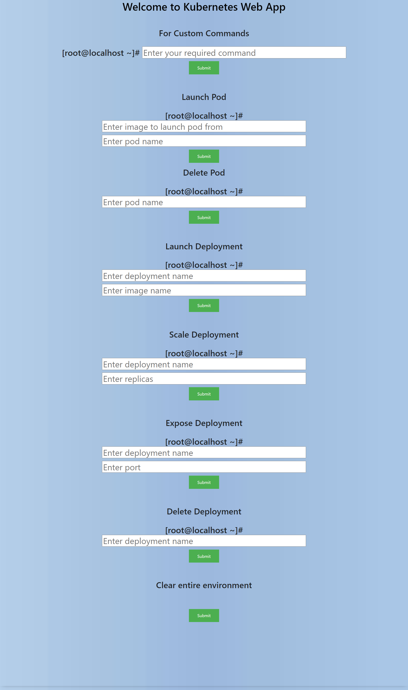
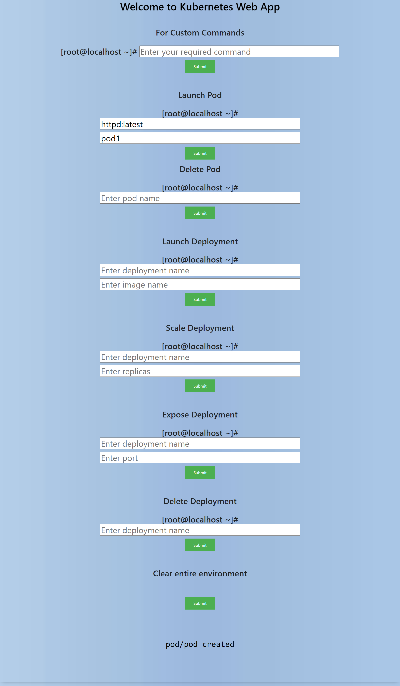
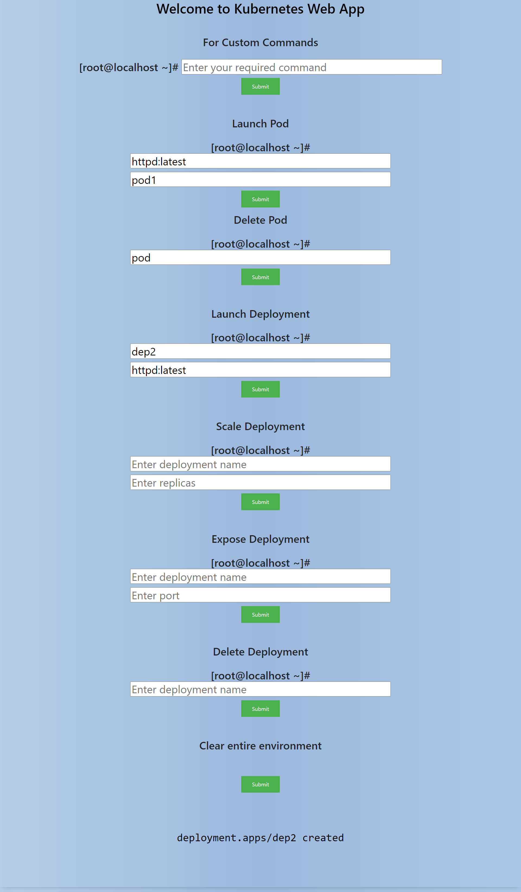

# cgi-kubernetes-app
This app has the capability to run K8S commands on remote server and display the results on the page without refreshing.
 
<h2>Screenshots</h2>

	<h2>Working</h2>
		 
        
		 
        
		 
        
	 

